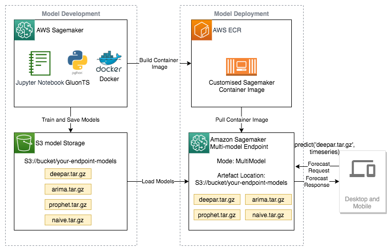

# Forecast electricity demand with GluonTS and SageMaker custom containers
Learn how to train and evaluate time series models with the Gluon TS library, and then deploy them for inference as a Multi-Model Server SageMaker endpoint using a custom SageMaker container.

## Level
- 300 Intermediate

## Datasets
- UC Irvine Machine Learning Repository - Individual household electric power consumption

## AWS services
- Amazon SageMaker
- AWS ECR
- Gluon TS

## Architecture diagram

## Getting Started
1. Set the the Conda virtual environment by excuting the command below:

    ./build_env.sh

2. Run the Jupyter Notebooks (select the Kernel named conda_gluonts-multimodel).
    - 00_predict_electricity_demand_with_the_gluonts_library.ipynb
    - 01_deploy_gluonts_forecast_models_as_multi_model_endpoints.ipynb

## Outline
- 1. Introduction
- 2. Problem definition
- 3. Architecture design
- 4. Prepare the Data - Download data - Resample data with pandas
- 5. Machine Learning Models
    - Train/Evaluate the mean model
    - Train/Evaluate the seasonal naive model
    - Train/Evaluate the exponential smoothing (ETS) model
    - Train/Evaluate the Prophet model
    - Train/Evaluate the DeepAR model
    - Comparison of models
- 6. Prepare the model artifacts for deployment
- 7. How to build the custom Sagemaker container for model deployment.
- 8. How to deploy models as Sagemaker Multi-model Endpoint and invoke the Endpoint.
- 9. Clean up the resources.
- 10. Conclusion

## License

This library is licensed under the MIT-0 License. See the LICENSE file.

