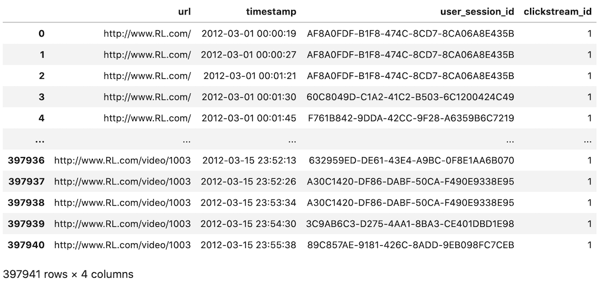
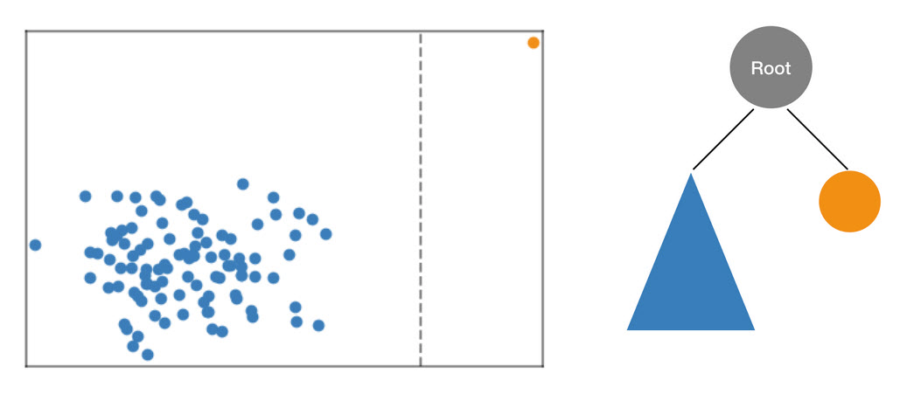
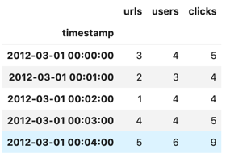

# 클릭스트림 시계열 데이터에 대한 이상 감지 (SageMaker Random Cut Forest 와 DeepAR 알고리즘 활용)

본 글은 시계열 데이터 분석 시리즈의 네번째 글입니다. 이번 글에서는 시계열 데이터 분석 중 이상감지 부분을 살펴보겠습니다. 이상 감지는 전처리작업에서 이상치를 찾아내는 것에서 부터 비즈니스 성과 모니터링의 매트릭에서 갑작스러운 급증이나 급감하는 이벤트를 찾아 알람을 보내는 등 다양한 방식으로 응용됩니다. 예를 들어 다음과 같은 이상감지 시나리오를 생각해 볼 수 있습니다.

- 이커머스 웹사이트에서 방문자 또는 클릭스트림 변화
- 유통업에서 판매건수 또는 판매금액의 변화
- 웹서비스 인프라에서 메모리와 CPU사용량의 변화
- 생산기계나 설비에서 센싱되는 온도, 진동, 전류, 토크 등의 변화

많은 경우, 그래프를 통해 이런 데이터를 시각화한 후 사람의 육안으로 살펴보면 특이한 변화를 쉽게 찾을 수 있습니다. 하지만, 실제 환경에서 동시에 수만건씩 발생하는 시계열데이터를 사람이 판별한다는 것은 현실적으로 불가능합니다. 그래서 대부분의 모니터링 시스템이 상한선과 하한선 기반의 알람 기능을 제공하지만, 이런 경우 경계값을 보수적으로 잡을 수 밖에 없게 되어 불필요하게 많은 알람을 발생시킵니다.


그럼 이런 작업을 수학과 알고리즘으로 자동화할 수는 없을까요? 본 글에서는 SageMaker에서 제공하는 두 가지 빌트인 알고리즘을 이용하여 이 문제를 해결해 보려고 합니다. 그리고 동일한 원리로 Amazon Kinesis Analytics의 기능을 이용하여 이상감지를 하는 부분까지 살펴보겠습니다.


### 클릭스트림 데이터

우리는 아래의 클릭스트림 데이터셋을 예제로 사용할 것입니다. 데이터셋은 사용자가 클릭한 페이지(url)와 클릭시간(timestamp) 등을 담고 있습니다. 이런데이터는 웹서비스에서 발생하는 로그를 파싱하여 쉽게 얻을 수 있을 것입니다.



SageMaker를 사용할 때, 데이터레이크는 개발에서부터 운영환경 배포까지 라이프사이클을 가속화 시킵니다. AWS는 로그를 수집하기 위해 Kineis, Glue, Athena와 같은 많은 편리한 서비스를 제공하고 있습니다. 클릭스트림 로그 수집을 위한 많은 참조 아키텍처가 있습니다. 예를 들면 [다음 블로그](https://aws.amazon.com/blogs/big-data/create-real-time-clickstream-sessions-and-run-analytics-with-amazon-kinesis-data-analytics-aws-glue-and-amazon-athena/)를 참조할 수 있습니다. 


### SageMaker Random Cut Forest

첫번째로 살펴볼 알고리즘은 SageMaker Random Cut Forest(RCF) 입니다. RCF는 다변량 데이터에서 이상감지를 위한 비지도학습 알고리즘입니다. 이 알고리즘의 핵심 아이디어는, 의사결정트리를 이용해 모든 값을 고립시킬 때 특이한 관측값일 수록 보다 쉽게 고립된다는 사실입니다.

예를 들어 관측값이 아래와 같이 분포할 때 임의의 의사결정트리로 이 값들을 고립시킨다고 가정해 보겠습니다. 오렌지색으로 표시된 이상치 값을 고립시키는 것은 파란색으로 표시된 서로 가까이 분포하는 점들을 고립시키는 것에 비해 훨씬 쉬울 것입니다. RCF는 모든 점에 대하여 이런 이상치 여부의 양을 알려주는 이상치 점수를 리턴할 것입니다.

RCF에 대한 보다 자세한 정보는 [SageMaker 개발자 문서](https://docs.aws.amazon.com/sagemaker/latest/dg/rcf_how-it-works.html) 또는 [다음 동영상](https://www.youtube.com/watch?v=yx1vf3uapX8)을 참고하세요. 




이상감지 알고리즘은 교통량 분석이나 볼륨변화 분석과 같이 단일 변량 시계열 데이터에도 많이 사용되지만 RCF는 단일 변량이 아닌 임의의 차원의 입력에 대해서도 잘 동작합니다. SageMaker RCF는 특성(feature)수, 데이터사이즈, 또는 인스턴스 개수에 따른 확장성을 제공합니다.

본 시나리오에서 우리는 클릭스트림 데이터셋을 3차원의 시계열로 변환하겠습니다. 아래 그림에서 'urls', 'users', 'clicks' 컬럼들입니다.
- urls : 1분 동안 클릭된 페이지 수
- users : 1분 동안 방문한 사용자 수
- clicks : 1분 동안 발생한 클릭 수




클릭스트림을 이 형식으로 변형하고 나면 이제 RCF학습은 몇 줄의 코드만으로 간단히 실행될 수 있습니다. 아래 코드에서는 SageMaker의 RandomCutForest 오브젝트를 선언하고 있습니다. 오브젝트 생성시에는 학습을 실행할 인스턴스 타입을 파리미터로 지정하고 있습니다. 아래 코드를 이용하여 작업 실행시 SageMaker는 m4.xlarge 사이즈의 인스턴스와 S3의 데이터를 이용하여 학습을 진행하여 모델을 생성하고, 작업이 완료되면 자동으로 자원을 다시 반납할 것입니다.


```python
from sagemaker import RandomCutForest

session = sagemaker.Session()
bucket = session.default_bucket()
prefix = 'rcf-clickstream'
execution_role = sagemaker.get_execution_role()

# specify general training job information
rcf = RandomCutForest(role=execution_role,
                      train_instance_count=1,
                      train_instance_type='ml.m4.xlarge',
                      data_location='s3://{}/{}/'.format(bucket, prefix),
                      output_path='s3://{}/{}/output'.format(bucket, prefix),
                      num_samples_per_tree=512,
                      num_trees=50)

# automatically upload the training data to S3 and run the training job
rcf.fit(rcf.record_set(s.to_numpy()))
```

학습작업이 끝난 후 이 모델을 추론 환경으로 배포합니다. 앞서 진행한 학습과정에서 학습모델과 관련된 모든 정보들이 이미 RCF Estimator 오브젝트에 저장되어 있으므로 간단히 rcf.deploy() 함수를 호출하는 것으로 배포를 실행할 수 있습니다. 배포를 할 때에는 또 다른 인스턴스 자원을 할당하고 있습니다. 이런 방식은 학습과 추론작업의 특성에 따라 적절한 자원을 선택할 수 있도록 해 줍니다. 다음 코드를 실행합니다.

```python
rcf_inference = rcf.deploy(
    initial_instance_count=1,
    instance_type='ml.m4.xlarge',
)
```

이제 엔드포인트는 이상치 점수를 리턴할 것입니다. 이제 전체 클릭스트림에 대해 계산된 이상치 점수의 분포를 살펴봅니다.

```python
results = rcf_inference.predict(s.to_numpy())
pd.DataFrame(results['scores']).hist()
```


히스토그램을 그리는 것은 종종 이상치 점수의 경계값(threshold)를 결정하는 데 유용합니다. RCF알고리즘이 비지도학습이었던 것을 기억합니다. 알고리즘은 자체로 경계값을 결정할 수 없습니다. 우리는 과거의 경험이나 전문가의 판단에 따라 이 경계값을 결정해야 합니다. 본 사례에서는 5 근처에서 값을 선택하겠습니다. 

다음은 이 경계값을 넘는 이상치 점수를 다시 가시화해봅니다. 아래 그림에서 url, users, clicks 3개의 시계열 값을 그래프로 그리고 이상치로 분류되는 점을 추가로 표시하였습니다.


시계열 데이터 내에서 특징적인 값을 잘 찾는 것 같습니다. 그래프가 너무 복잡하므로 3월 6일 부근을 좀 더 확대해 보겠습니다. 


이상치 점수가 단순히 고정된 상한선/하한선 값에 의해 계산된 것이 아님을 알 수 있습니다. 이상치로 표시된 어떤 점들은 빨간색 고정값 라인보다 아래에 위치 하고 있으며 빨간선 위의 관측값에서도 이상치가 아니라고 표시된 점들이 확인됩니다.

곧, 단순히 상한선/하한선 기준의경계값이 아니라 이 이상치 점수를 경계로 사용한다면 보다 동적으로 이상치를 가지는 점을 파악할 수 있다는 의미가 됩니다. 


### SageMaker DeepAR

많은 시계열 데이터 연구가 미래 시계열에 대한 예측을 다루고 있습니다. 이런 시계열 데이터 예측 알고리즘 또한 이상치의 탐색에 사용될 수 있습니다. 미래의 시계열은 과거의 패턴을 기반으로 합니다. 이것은 다시 말하면, 측정된 실제 시계열이 과거의 패턴과 많이 다르다면, (과거를 기반으로 예측된) 예측된 미래 시계열을 크게 벗어나게 될 것이고, 이 범위를 벗어나는 경우 실측값에 이상현상이 나타나고 있다고 있다고 이해할 수 있을 것입니다.

Amazon SageMaker DeepAR 알고리즘은 RNN(Recurrent Neural Networks)을 이용하여 단일차원의 시계열의 변량을 예측하는 지도학습 알고리즘입니다. DeeAR알고리즘은 ARIMA(autoregressive integrated moving average) 또는 ETS(exponential smoothing)와 같은 전통적인 알고리즘과 달리 연관된 시계열데이터(related timeseries)와 시계열에 대한 메타정보를 특성(feature)로 고려할 수 있습니다.

본 시나리오에서는 10분 동안의 클릭수를 예측하고자하는 목표 시계열로 하고 10분동안 방문한 사용자 수를 연관된 시계열데이터로 사용하겠습니다. 그리고 시계열은 방문한 페이지(url)별로 분할하겠습니다. (이 구조는 만약 이 사례에 유통업의 판매량 예측이라면, url을 판매하는 제품으로, 클릭을 판매금액으로 대응시켜 생각해 볼 수 있을 것입니다.)


SageMaker의 DeepAR을 사용하기 위해 레코드 포맷을 변경합니다. 입력되는 데이터는 다음 필드를 가지고 있어야 합니다. 

- start : 시작시간(timestamp). YYYY-MM-DD HH:MM:SS 형태의 문자열 형식.
- target : 시계열 데이터를 나타내는 실수 또는 정수로 된 배열. 여기서는 10분 동안 발생한 클릭수 값을 사용함
- dynamic_feat (optional) : 시계열로 된 특성벡터를 지정하기 위한 실수 또는 수로 된 배열의 배열. 여기서는 10분동안 방문한 방문자 수를 dynaic feature로 사용함
- cat (optional) : 레코드가 소속된 그룹의 특성을 나타내는 명목형 값에 대한 배열. 본 예제에서는 이 값은 사용하지 않음

```json
# example:
{"start": "2012-03-01 00:00:00", "target": [24.0, 22.0, 20.0, 17.0, ...], "dynamic_feat": [[13, 14, 8, ...]]}
```

DeeAR에 대한 입출력 포맷은 다음 [개발자 문서](https://docs.aws.amazon.com/sagemaker/latest/dg/deepar.html#deepar-inputoutput)를 참고합니다.

이 파일이 생성되고 나면 나머지 과정은 다른 빌트인 알고리즘을 쓰는 것과 거의 동일합니다. 파일을 S3에 업로드하고, 알고리즘과 하이퍼파리미터를 이용하여 Estimator를 선언하고, 준비한 학습데이터를 이용하여 학습시킵니다. 하이퍼파라미터에서 예측기간과 컨텍스트 기간은 24시간으로 주었습니다. 


```python
import sagemaker

role = sagemaker.get_execution_role()       
train_s3 = sagemaker_session.upload_data(path='train.json', key_prefix=s3_prefix)
image_name = sagemaker.amazon.amazon_estimator.get_image_uri(region, "forecasting-deepar", "latest")

estimator = sagemaker.estimator.Estimator(
    sagemaker_session=sagemaker_session,
    image_name=image_name,
    role=role,
    train_instance_count=1,
    train_instance_type='ml.c4.2xlarge',
    base_job_name='deepar-clickstream'
)
hyperparameters = {
    "time_freq": '10min',
    "epochs": "400",
    "early_stopping_patience": "40",
    "mini_batch_size": "64",
    "learning_rate": "5E-4",
    "context_length": str(24 * 6),
    "prediction_length": str(24 * 6)
}
estimator.set_hyperparameters(**hyperparameters)
estimator.fit({"train": train_s3}, wait=True)
```

RCF에서 했던 것처럼 학습이 완료된 후 엔드포인트를 생성합니다. 이번에 생성한 엔드포인트는 미래 시계열데이터 예측시 0.1, 0.5, 0.9 quantile에 대한 분포를 리턴할 것입니다


```python
predictor = estimator.deploy(
    initial_instance_count=1,
    instance_type='ml.m4.xlarge',
    predictor_cls=DeepARPredictor, 
    wait=False)

infs = pd.Series(data[0]['target'][:-144])
infs.index=pd.date_range(data[0]['start'], datetime.datetime.strptime(data[0]['start'],  '%Y-%m-%d %H:%M:%S') + datetime.timedelta(minutes=10*2015), freq='10T')

```

예측결과를 그래프로 살펴보겠습니다. 시계열 예측결과가 정확하다면, 예측범위를 벗어나는 관측값은 이상치로 간주될 수 있을 것입니다. 본 실험결과에서 파란색 선으로 표시된 실제 관측값의 대부분은 파란색으로 표시된 0.1, 0.9 quantile 범위에 포함되고 있습니다. 그림에서 빨간색 점은 예측 범위를 벗어나는 실측값입니다. 빨간색 선은 0.5 quantile에 대한 예측값입니다. 


다음 그림은 예측결과를 10분에서 2시간으로 다시 샘플링한 결과입니다. 비즈니스케이스에 따라 예측단위는 학습데이터의 단위와 다를 수 있습니다. 만약 예측의 시간단위가 더 크다면 예측결과는 보다 부드러운 곡선으로 바뀔 것입니다. 이런 변경은 시계열 데이터 예측결과 범위를 모니터링을 위한 상한선 또는 하한선으로 설정할 때 너무 많은 빈도의 알람을 줄이는데에도 적용할 수 있을 것입니다. 


### Amazon Kinesis Analytics RCF

추가로 Amazon Kinesis Analytics에 내장된 통계분산 함수를 이용하여 이상감지를 실행하는 방법을 살펴보겠습니다. Kinesis Analytics는 클릭스트림과 같은 실시간 스트리밍 데이터를 처리하고 분석하는 AWS 관리형 서비스입니다. Kinesis Data Analytics를 이용하면 스트리밍 데이터를 처리하고 분석할 수 있고, 스트림을 집계하거나 변경하고, 대시보드를 생성하거나 실시간 지표를 생성할 수도 있습니다. Kinesis Data Analytics 에서의 데이터변환은 SQL이나 Apache Flink 등을 이용하여 스트림을 변환할 수 있는 환경을 제공하며 많은 내장 함수를 제공하고 있습니다. 내장된 스트림 함수 중 이상감지와 관련한 함수는 RANDOM_CUT_FOREST와 RANDOM_CUT_FOREST_WITH_EXPLATION 함수가 있으며, 본 글에서는 RANDOM_CUT_FOREST_WITH_EXPLATION 함수를 이용하여 스트림의 이상감지를 진행합니다.

동일한 데이터를 이용하여 이번에는 AWS Kinesis Data Stream으로 데이터를 전송합니다. Kinesis 스트림 데이터의 생성은 API나 [KPL(Kinesis Producer Library)](https://docs.aws.amazon.com/streams/latest/dev/developing-producers-with-kpl.html), 또는 [Amazon Kinesis Agent](https://docs.aws.amazon.com/streams/latest/dev/writing-with-agents.html) 등을 이용할 수 있습니다. 아래 코드는 AWS Python SDK의 [put_record](https://docs.aws.amazon.com/kinesis/latest/APIReference/API_PutRecord.html) API를 이용하여 데이터를 전송하는 예제입니다.

```python
kinesis_client = boto3.client('kinesis')          # define client with aws python SDK
kinesis_data = json.dumps(make_kinesis_data(...)) # converts data to kinesis input format
kinesis_client.put_record(                        # send record to the Cloud
    StreamName=data_stream[0],
    Data=kinesis_data,
    PartitionKey=str(rnd)
)
```

위 코드를 통해 생성한 Kinesis Data Stream을 입력소스로 하여 Kinesis Analytics에서 이 스트림을 변환하는 애플리케이션을 생성할 수 있으며 이 때 여러 내장함수를 호출할 수 있습니다. 아래 코드는 SQL을 이용하여 변환을 실행하고 RANDOM_CUT_FOREST 함수를 이용하여 이상감지를 실행하는 예제입니다. 마치 DB를 조회하는 SQL에서 내장함수를 호출하듯, RANDOM_CUT_FOREST_WITH_EXPLANATION 함수를 호출하고 스트림으로부터 ANOMALY_SCORE와 ANOMALY_EXPLANATION 값을 계산하게 됩니다.


```sql
CREATE OR REPLACE STREAM "TEMP_STREAM" (
   "TIMESTAMPS"          TIMESTAMP,
   "URLS"                INTEGER,
   "USERS"               INTEGER,
   "CLICKS"              INTEGER,
   "ANOMALY_SCORE"       DOUBLE,
   "ANOMALY_EXPLANATION" varchar(512));

CREATE OR REPLACE PUMP "STREAM_PUMP" AS INSERT INTO "TEMP_STREAM"
SELECT STREAM "TIMESTAMPS", "URLS", "USERS", "CLICKS", "ANOMALY_SCORE", "ANOMALY_EXPLANATION" FROM
  TABLE(RANDOM_CUT_FOREST_WITH_EXPLANATION(
    CURSOR(SELECT STREAM * FROM "SOURCE_SQL_STREAM_001"), -- inputStream
    100, -- numberOfTrees
    256, -- subSampleSize
    100000, -- timeDecay
    1, -- shingleSize
    true
  )
);
```

알고리즘의 동작원리는 SageMaker에서 살펴본 내용과 동일합니다. RANDOM_CUT_FOREST와 달리 RANDOM_CUT_FOREST_WITH_EXPLANATION 함수에서는 추가로 해석과 관련한 값을 리턴해 줍니다. Anomaly score와 별도로 리턴되는 값은 다음과 같습니다.
 
- Attribution score : 해당 컬럼이 anomaly score에 얼마나 영향을 미쳤는지에 대한 정량적 값
- Strength : 해당 컬럼의 값이 가지는 방향성의 수준 
- Directionality : 최근 관찰된 트랜드에 비하여 높으면 HIGH 그렇지 안으면 LOW값 리턴

- Attribution score : A nonnegative number that indicates how much this column has contributed to the anomaly score of the record
- Strength : A nonnegative number representing the strength of the directional recommendation.
- Directionality : This is either HIGH if the value of the column is above the recently observed trend or LOW if it’s below the trend. During the learning phase, this defaults to LOW.

Kineis Anaytics에서 리턴한 값을 살펴보겠습니다. SageMaker를 이용할 때처럼 이상치를 판단할 경계값을 결정하고 이 값을 초과하는 Anomaly Score를 가지는 레코드를 그래프로 표시해 보겠습니다. 아래 그림을 통해 Kinesis를 이용하여 찾아낸 이상치를 확인할 수 있습니다.


The graph at the bottom shows the portion to which each column contributed to the anomaly score.
We can see that the number of clicks contributes a lot in general. And when the number of clicks or visitors does not change significantly, the number of pages contributes the most.(See the graph after 22:00 on 5th March.)

아래 그래프는 이상치 값과 함께 컬럼별로 이 이상치 값에 기여한 정도를 표시한 것입니다. 아래쪽 그래프를 보시면 경계값을 넘는 이상치 점을 찾을 때에는 주로 클릭수가 영향을 미쳤다는 것을 확인할 수 있습니다. 그리고 3월 5일 22시 이후쪽을 보면, 클릭수나 방문자수가 크게 변동되지 않을 때에는 방문페이지(url)수가 Anomaly score를 계산할 때 보다 비중있게 다루어졌다는 것을 알 수 있습니다.


### 정리

본 블로그에서 우리는 SageMaker의 빌트인 알고리즘을 사용하여 시계열데이터의 이상치를 감지하는 두가지 사례를 알아보았습니다. 그리고 Kinesis에 내장된 이상감지 함수를 이용하여 실시간 스트림으로부터 직접 이 값을 계산하는 방법을 살펴보았습니다. 이와 같이 SageMaker의 빌트인 알고리즘을 사용하면 보다 간단히 머신러닝 모델을 개발할 수 있으며 실제 운영환경에도 보다 쉽게 배포할 수 있습니다. 그리고 Kinesis Analytics을 이용하면 별도의 인프라 관리없이 실시간 스트림을 저장, 변환, 활용할 수 있으며 이를 위한 많은 부가기능들을 제공합니다.

이 글은 시계열 데이터분석 시리즈의 마지막 글입니다. 우리는 지금까지 시계열 데이터를 다루는 4가지 주요 시나리오를 살펴보았습니다. 본 시리즈가 시계열 데이터의 다양한 문제를 다루는데 인사이트를 드릴 수 있었기를 기대합니다. 다른 블로그 포스트는 아래 링크에서 확인할 수 있습니다. 

- Introduction to time series forecasting with SageMaker and Python by Eric Greene
- Benchmarking popular time series forecasting algorithms on electricity demand forecast by Yin Song
- Implementing Rapid and Cost-effective Demand Forecasting with AWS Solutions by Yoshiyuki Ito
