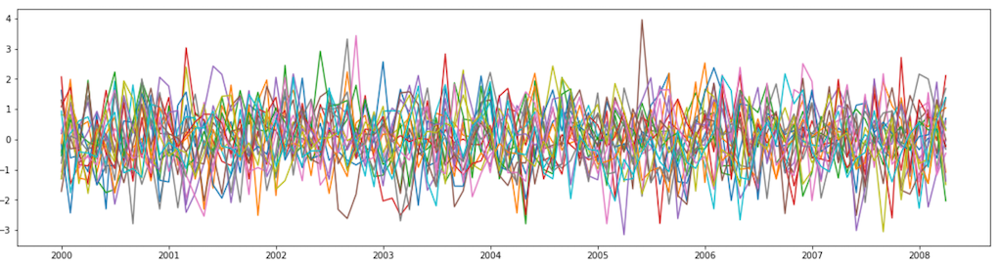

# Anomaly detection from clickstream timeseries (with SageMaker algorithm Random Cut Forest and DeepAR)

As the last series dealing with time series data, let's look at the anomaly detection form time series data. Anomaly detection is broadly applied from finding outliers for data preprocessing to monitoring the business performance alarming sudden spikes or drops in business metrics. For example, some of these usecases are finding regular events from:

- The number of visitors or clickstreams in e-commerce websites
- Changes in the number of items sold or the amount of sales in retail business
- Changes in usage of memory and CPU in web service infrastructure
- Changes in sensing values such as temperature, vibration, current, torque, etc. from production machines or equipments

In many cases, human eye can find irregular changes easily, if these data are visualized through graph. However, in real life, it is impossible for humans to visually check all of the time series data generated by hundreds of thousands at the same time. Many time series monitoring systems are provided with a alarming features with simple upper or lower limits, but they end up generating too many unnecessarily fake alarms. 



Then, how can this be automated with math and programs? In this blog post, we will solve this problem by using two built-in algorithms provided by SageMaker. 

### Clickstream dataset

As a example scenario, we will use below clickstream dataset. Dataset contains urls that user clicked, timestamp when user clicked, etc. We can easily get this type of data by parsing the log of the web service.


We will use SageMaker to analyze the anomalies and DataLake will accelerate the cycle from  development to operation in production environment. AWS provides various services such as kinesis, glue, and athena for data lake and log collection. There are many reference architectures and guides for collecting clickstream logs. For example, we recommend to read [this blog post](https://aws.amazon.com/blogs/big-data/create-real-time-clickstream-sessions-and-run-analytics-with-amazon-kinesis-data-analytics-aws-glue-and-amazon-athena/).

### SageMaker Random Cut Forest

The first algorithm to look at is Amazon SageMaker Random Cut Forest (RCF). RCF is an unsupervised algorithm for detecting anomalous data points within a data set. The key idea of this algorithm is that, when you use a decision tree to isolate all measurements, the more irregular the easier you can isolate. 

If the observations are distributed as follows and we are isolating these observations with an arbitrary decision tree, isolating outlier values marked in orange would be much easier than isolating values of one of the blue points which are distributed closer together. With each data point, RCF will return anomaly score to tell us the amount of irregularity. 

You may find more detailed explanation from here: [SageMaker document](https://docs.aws.amazon.com/sagemaker/latest/dg/rcf_how-it-works.html), or [youtube video](https://www.youtube.com/watch?v=yx1vf3uapX8))


While there are many applications of anomaly detection algorithms to one-dimensional time series data such as traffic volume analysis or sound volume spike detection, RCF is designed to work with arbitrary-dimensional input. Amazon SageMaker RCF scales well with respect to number of features, data set size, and number of instances.

For our scenario, let's transform our clickstream dataset into a new 3 dimensional timeseries. In the picture below, 'urls', 'users', and 'clicks' mean the number of visited pages, users, and clicks aggregated from the click logs that occurred for 1 minute.


If you transformed the clickstream into this format, learning RCF is now simple with just a few lines of code. In the example code below, while calling sagemaker's RCF algorithm, the resource type to be used and the path of the training data are passed as parameters. SageMaker will allocate m4.xlarge resources for training, create a model using s3 training data, and automatically return the resources back when the job is complete.

```python
from sagemaker import RandomCutForest

session = sagemaker.Session()
bucket = session.default_bucket()
prefix = 'rcf-clickstream'
execution_role = sagemaker.get_execution_role()

# specify general training job information
rcf = RandomCutForest(role=execution_role,
                      train_instance_count=1,
                      train_instance_type='ml.m4.xlarge',
                      data_location='s3://{}/{}/'.format(bucket, prefix),
                      output_path='s3://{}/{}/output'.format(bucket, prefix),
                      num_samples_per_tree=512,
                      num_trees=50)

# automatically upload the training data to S3 and run the training job
rcf.fit(rcf.record_set(s.to_numpy()))
```

When training is complete, an endpoint is created for inference work. Since all the information is recorded in the rcf Estimator object declared in the learning step, deployment process can be done simply by calling the rcf.deploy() function. And, when deploying, you can designate a specific instance resource again. 

```python
rcf_inference = rcf.deploy(
    initial_instance_count=1,
    instance_type='ml.m4.xlarge',
)
```

Now calling this endpoint will return the anomaly score. First, let's look at the distribution of anomaly scores calculated for the entire clickstream.

```python
results = rcf_inference.predict(s.to_numpy())
pd.DataFrame(results['scores']).hist()
```


Drawing a histogram is very useful when deciding the threshold of anomaly scores. Remember that the RCF algorithm was unsupervised learning. The algorithm itself cannot decide the threshold value. We need to set the threshold value according to past experience or expert judgment. In this example, we will choose a value around 5. 

Then plot the timeseries again with the anomaly score exceeding this threshold. We ploted 3 timeseries of urls, users, clikcks features and marked the anomalies as a point.


It seems to be catching characteristic points in the time series well. The graph is too complicated, so we will zoom in around March 6th.


We can see that anomaly score was not calculated based only on the deviation from fixed upper or lower limits. (Some points marked as anomaly are below the certain number and some points exceeding that number scored normal.) 

In other words, when we use this anomaly score as a threshold instead of a simple fixed upper/lower limit, we can find anomalous points more dynamically. 

### SageMaker DeepAR

Many of time series studies deal with predictions for future time series. These time series prediction algorithms can also be used to detect anomalies. The prediction of future time series is based on past patterns. This means that if the input time series is unusually different from the past pattern, it will  deviate significantly from the predicted future time series.

The Amazon SageMaker DeepAR forecasting algorithm is a supervised learning algorithm for forecasting scalar (one-dimensional) time series using Recurrent Neural Networks (RNN). Unlike traditional algorithms such as ARIMA(autoregressive integrated moving average) or ETS(exponential smoothing), DeepAR can take into account additional features such as related time series or meta information of timeseries together. 

In this scenario, we will use the number of clicks in 10 minutes as target series and the number of visitors in 10 minutes as related series(dynamic feature).  We will divide timeseries by url(page). Each url will have its own clickstreams. You can consider url as the product sold and clicks as sales if we transform this usecase into the retail scenario. 


In order to use DeepAR of SageMaker, we will change the record format. The records in your input files should contain the following fields:

- start—The start timestamp. A string with the format YYYY-MM-DD HH:MM:SS.
- target—An array of floating-point values or integers that represent the time series. Here, we will use clickstream counts in 10 minutes for forecasting value.
- dynamic_feat (optional)—An array of arrays of floating-point values or integers that represents the vector of custom feature time series. Here, we will use the number of visitors in 10 minutes for dynamic features.
- cat (optional)—An array of categorical features that can be used to encode the groups that the record belongs to. We do not use categorical values in this example.

```json
# example:
{"start": "2012-03-01 00:00:00", "target": [24.0, 22.0, 20.0, 17.0, ...], "dynamic_feat": [[13, 14, 8, ...]]}
```

For more information regarding input/outpot format of DeepAR, you can refer to this [developer document.](https://docs.aws.amazon.com/sagemaker/latest/dg/deepar.html#deepar-inputoutput) 

Once you have created this file, the rest of the process is the same as using other built-in algorithms. You need to upload this file to S3, define Estimator with algorithm and hyperparameters, and fit the model with the training data that we prepared. As hyperparameters, we set prediction length and context length as 24 hours. 

```python
import sagemaker

role = sagemaker.get_execution_role()       
train_s3 = sagemaker_session.upload_data(path='train.json', key_prefix=s3_prefix)
image_name = sagemaker.amazon.amazon_estimator.get_image_uri(region, "forecasting-deepar", "latest")

estimator = sagemaker.estimator.Estimator(
    sagemaker_session=sagemaker_session,
    image_name=image_name,
    role=role,
    train_instance_count=1,
    train_instance_type='ml.c4.2xlarge',
    base_job_name='deepar-clickstream'
)
hyperparameters = {
    "time_freq": '10min',
    "epochs": "400",
    "early_stopping_patience": "40",
    "mini_batch_size": "64",
    "learning_rate": "5E-4",
    "context_length": str(24 * 6),
    "prediction_length": str(24 * 6)
}
estimator.set_hyperparameters(**hyperparameters)
estimator.fit({"train": train_s3}, wait=True)
```

After the training, we will create an endpoint and run predictions like RCF. This time, the model will return the distributed timeseries prediction for 0.1, 0.5, and 0.9 quantiles. 

```python
predictor = estimator.deploy(
    initial_instance_count=1,
    instance_type='ml.m4.xlarge',
    predictor_cls=DeepARPredictor, 
    wait=False)

infs = pd.Series(data[0]['target'][:-144])
infs.index=pd.date_range(data[0]['start'], datetime.datetime.strptime(data[0]['start'],  '%Y-%m-%d %H:%M:%S') + datetime.timedelta(minutes=10*2015), freq='10T')

```

Then, let's plot the forecasting results. If the prediction of the time series is precise, observations outside the prediction range can be considered outliers. It can be seen that real observations indicated by the blue line are mostly included in the prediction range between 0.1 and 0.9 quantile filled with blue color. The red dots in the figure are real observations outside this prediction range. The red line in the future time space is the 0.5 point prediction.


The following figure is the result of resample the prediction result for 10 minutes every 2 hours. Depending on the business case, the unit to be used for forecasting may be different from the unit to be used when applied to actual work. When setting the upper/lower monitoring limit with the prediction range of time series, this kind of manipulation can be used to reduce too frequent noise alarms. 


### Conclusion

In this blog post, we introduced an example of how to use SageMaker built-in algorithms to detect anomalous points in timeseries. When we use built-in algorithms provided by SageMaker, we can develop the model with simple steps and deploy them to real application much more easier. 

This is the final post of the series of timeseries analytics. We have covered  4 major scenarios to handle timeseres. We hope our posts help you get more insight to tackle various timeseries problems. You can find other posts below:

- Introduction to time series forecasting with SageMaker and Python by Eric Greene
- Benchmarking popular time series forecasting algorithms on electricity demand forecast by Yin Song
- Implementing Rapid and Cost-effective Demand Forecasting with AWS Solutions by Yoshiyuki Ito