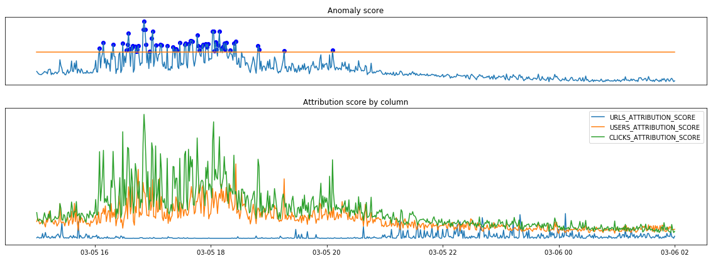

# Anomaly detection from clickstream time series (with SageMaker algorithm Random Cut Forest and DeepAR)

This is the 4th post of time series anaytics series. This post will look at the anomaly detection form time series data. Anomaly detection has wide range of applications, from finding outliers for preprocessing data to monitoring business performance for sudden spike or drop alerts in business metrics. For example, it is used for finding abnormal events in the following data:

- The number of visitors or clickstreams in e-commerce websites
- Changes in the number of items sold or the amount of sales in retail business
- Changes in usage of memory and CPU in web service infrastructure
- Changes in sensing values such as temperature, vibration, current, torque, etc. from production machines or equipments

In many cases, human eyes can find irregular changes easily if these data are visualized through graph. However, in real life, it is impossible for humans to visually check all hundreds of thousands of time series data generated simultaneously. Most of the monitoring systems are provided with a alarming features with upper or lower limits, but they end up generating too many unnecessary alarms. 


Then, how can we automate this using math and algorithms? In this blog post, we will try to solve this problem by using two built-in algorithms provided by SageMaker. And we will look at the Kinesis Analytics functions using same principle. 

### Clickstream dataset

We will use below clickstream dataset as an example. Dataset contains urls that users clicked, its timestamps, and etc. We can easily get this type of data by parsing the logs of the web services.


When using SageMaker, Data Lake will accelerate the cycle from development to deployment on production environment. AWS provides many convenient services such as Kinesis, Glue, and Athena for Data Lake and log collection. There are lots of reference architectures and guides for collecting clickstream logs. For example, we recommend to read [this blog post](https://aws.amazon.com/blogs/big-data/create-real-time-clickstream-sessions-and-run-analytics-with-amazon-kinesis-data-analytics-aws-glue-and-amazon-athena/).

### SageMaker Random Cut Forest

The first algorithm to look at is Amazon SageMaker Random Cut Forest (RCF). RCF is an unsupervised algorithm for detecting anomalous data points within a multi-dimensional dataset. The core idea of this algorithm is that irregular observations can be more easily found when using a decision tree to isolate all measurements.

Let's say the observations are distributed as follows and we are isolating these points with an arbitrary decision tree. Isolating outlier values marked in orange would be much easier than isolating values of one of the blue points which are distributed closely together. For each data point, RCF will return anomaly score to tell us the amount of irregularity. 

You may find more detailed explanation from here: [SageMaker document](https://docs.aws.amazon.com/sagemaker/latest/dg/rcf_how-it-works.html), or [youtube video](https://www.youtube.com/watch?v=yx1vf3uapX8))


While there are many applications of anomaly detection algorithms for one-dimensional time series data such as traffic volume analysis or sound volume spike detection, RCF is designed to work with arbitrary-dimensional input. Amazon SageMaker RCF scales well with respect to number of features, data set size, and number of instances.

In this scenario, we will transform our clickstream dataset into a new 3 dimensional time series. In the picture below, there are 'urls', 'users', and 'clicks' columns. 
- urls : the number of pages visited in 1 minute
- users : the number of users visisted in 1 minute
- clicks : the number of clicks that occurred for 1 minute.


If you transformed the clickstream into this format, learning RCF is now simple with just a few lines of code. In the example code below, we define SageMaker RandomCutForest object. We pass the resource type to be used and the path of training dataset as parameters. SageMaker will allocate m4.xlarge resources for training, create a model using s3 training data, and automatically return the resources back when the job is complete.

```python
from sagemaker import RandomCutForest

session = sagemaker.Session()
bucket = session.default_bucket()
prefix = 'rcf-clickstream'
execution_role = sagemaker.get_execution_role()

# specify general training job information
rcf = RandomCutForest(role=execution_role,
                      train_instance_count=1,
                      train_instance_type='ml.m4.xlarge',
                      data_location='s3://{}/{}/'.format(bucket, prefix),
                      output_path='s3://{}/{}/output'.format(bucket, prefix),
                      num_samples_per_tree=512,
                      num_trees=50)

# automatically upload the training data to S3 and run the training job
rcf.fit(rcf.record_set(s.to_numpy()))
```

Next, we will deploy the model for inference after the training job is finished. Since all the details regarding trained model are recorded in the RCF Estimator object declared in the learning step, deployment process can be done simply by calling the rcf.deploy() function. When deploying, we pass another instance resource again. This structure allows you to designate appropriate resources for training or inference tasks.

```python
rcf_inference = rcf.deploy(
    initial_instance_count=1,
    instance_type='ml.m4.xlarge',
)
```

Now, this endpoint returns the anomaly score for our dataset. Let's look at the distribution of anomaly scores calculated for the entire clickstream.

```python
results = rcf_inference.predict(s.to_numpy())
pd.DataFrame(results['scores']).hist()
```


Drawing a histogram is often useful when deciding the threshold of anomaly scores. Remember that the RCF algorithm is unsupervised learning. The algorithm itself cannot decide the threshold value. We need to set the threshold value according to past experience or expert judgment. In this example, we will choose a value around 5. 

Then, plot the time series again with the anomaly score exceeding this threshold. We ploted 3 time series of urls, users, clikcks features and marked the anomalies as a point.


It seems to grasp characteristic points in the time series well. The graph is too complicated, so we will zoom in around March 6th.


It can be seen that anomaly scores are not calculated solely based on deviations from a fixed upper or lower limit. Some points marked as anomaly are placed below the fixed red line and some points marked normal are placed above the red line.  

In other words, using this anomaly score as a threshold instead of a simple fixed upper/lower limit will allow you to find anomalous points more dynamically.

### SageMaker DeepAR

Most of the time series studies deal with predictions for future time series. These time series prediction algorithms can also be used to detect anomalies. The prediction of future time series is based on past patterns. This means that if the input time series is unusually different from the past pattern, it will deviate significantly from the predicted future time series.

The Amazon SageMaker DeepAR forecasting algorithm is a supervised learning algorithm for forecasting scalar (one-dimensional) time series using Recurrent Neural Networks (RNN). Unlike traditional algorithms such as ARIMA(autoregressive integrated moving average) or ETS(exponential smoothing), DeepAR can take into account additional features such as related time series or meta information of time series together. 

In this scenario, we will use the number of clicks in 10 minutes as target series and the number of visitors in 10 minutes as related series(dynamic feature).  We will divide time series by url(page). Each url will have its own clickstreams. You can consider url as a product sold and clicks as sales if we transform this usecase into the retail business. 


In order to use DeepAR of SageMaker, we should change the record format. The records in your input files should contain the following fields:

- start : The start timestamp. A string with the format of YYYY-MM-DD HH:MM:SS.
- target : An array of floating-point values or integers that represent the time series. Here, we will use clickstream counts in 10 minutes for forecasting value.
- dynamic_feat (optional) : An array of arrays of floating-point values or integers that represents the vector of custom feature time series. Here, we will use the number of visitors in 10 minutes for dynamic features.
- cat (optional) : An array of categorical features that can be used to encode the groups that the record belongs to. We do not use categorical values in this example.

```json
# example:
{"start": "2012-03-01 00:00:00", "target": [24.0, 22.0, 20.0, 17.0, ...], "dynamic_feat": [[13, 14, 8, ...]]}
```

For more information about input/outpot format of DeepAR, you can refer to this [developer document.](https://docs.aws.amazon.com/sagemaker/latest/dg/deepar.html#deepar-inputoutput) 

Once you have created this file, the rest of the process is the almost same as using other built-in algorithms. You need to upload this file to S3, define Estimator with algorithm and hyperparameters, and fit the model with the training data that we prepared. As hyperparameters, we set prediction length and context length as 24 hours. 

```python
import sagemaker

role = sagemaker.get_execution_role()       
train_s3 = sagemaker_session.upload_data(path='train.json', key_prefix=s3_prefix)
image_name = sagemaker.amazon.amazon_estimator.get_image_uri(region, "forecasting-deepar", "latest")

estimator = sagemaker.estimator.Estimator(
    sagemaker_session=sagemaker_session,
    image_name=image_name,
    role=role,
    train_instance_count=1,
    train_instance_type='ml.c4.2xlarge',
    base_job_name='deepar-clickstream'
)
hyperparameters = {
    "time_freq": '10min',
    "epochs": "400",
    "early_stopping_patience": "40",
    "mini_batch_size": "64",
    "learning_rate": "5E-4",
    "context_length": str(24 * 6),
    "prediction_length": str(24 * 6)
}
estimator.set_hyperparameters(**hyperparameters)
estimator.fit({"train": train_s3}, wait=True)
```

After the training, we will create an endpoint and run predictions just like RCF. This time, the model will return the distributed time series prediction for 0.1, 0.5, and 0.9 quantiles. 

```python
predictor = estimator.deploy(
    initial_instance_count=1,
    instance_type='ml.m4.xlarge',
    predictor_cls=DeepARPredictor, 
    wait=False)

infs = pd.Series(data[0]['target'][:-144])
infs.index=pd.date_range(data[0]['start'], datetime.datetime.strptime(data[0]['start'],  '%Y-%m-%d %H:%M:%S') + datetime.timedelta(minutes=10*2015), freq='10T')

```

Then, let's plot the forecasting results. If the prediction of the time series is precise, observations outside the prediction range can be considered outliers. In our forecasting result, it seems that real observations indicated by the blue line are mostly included in the prediction range between 0.1 and 0.9 quantile filled with blue color. The red dots in the figure are real observations outside this prediction range. The red line in the future time space is the 0.5 point prediction.


The following figure is the result of resampling the prediction results from 10 minutes to 2 hours. Depending on the business case, the forecasting unit may be different from the one used in the training. If you resample them with larger units of time, the prediction results will be smoother. This kind of manipulation can be used to prevent too much frequent noise alarms when setting the upper/lower monitoring limit with the prediction range of time series. 


### Amazon Kinesis Analytics RCF

In addition, let's see how to perform anomaly detection using the statistical variance and deviation functions built in Amazon Kinesis Analytics. Kinesis Analytics is an AWS managed service that processes and analyzes real-time streaming data such as clickstreams. With Kinesis Data Analytics, you can process and analyze streaming data, aggregate or change streams, create dashboards, or generate real-time metrics. Data conversion in Kinesis Data Analytics provides an environment for converting streams using SQL or Apache Flink, and built-in functions. Among the built-in stream functions, there are RANDOM_CUT_FOREST and RANDOM_CUT_FOREST_WITH_EXPLATION functions to calculate anomaly score. In this article, we use the RANDOM_CUT_FOREST_WITH_EXPLATION function.

With the same dataset, we will send the data to AWS Kinesis Data Stream. AWS provides APIs, [Kinesis Producer Library (KPL)](https://docs.aws.amazon.com/streams/latest/dev/developing-producers-with-kpl.html), and [Amazon Kinesis Agent](https://docs.aws.amazon.com/streams/latest/dev/writing-with-agents.html) to support this task. The code below is an example of sending data using the [put_record](https://docs.aws.amazon.com/kinesis/latest/APIReference/API_PutRecord.html) API in AWS Python SDK.


```python
kinesis_client = boto3.client('kinesis')          # define client with aws python SDK
kinesis_data = json.dumps(make_kinesis_data(...)) # converts data to kinesis input format
kinesis_client.put_record(                        # send record to the Cloud
    StreamName=data_stream[0],
    Data=kinesis_data,
    PartitionKey=str(rnd)
)
```

Now you can create a Kinesis Analytics application that transforms the Kinesis Data Stream source that you created with above code. When writing transform code you can call built-in functions. The code below is an example of executing the RANDOM_CUT_FOREST function with standard SQL. Just like calling internal functions with SQL for a Relational Database, you can simply call the RANDOM_CUT_FOREST_WITH_EXPLANATION function and calcuate ANOMALY_SCORE and ANOMALY_EXPLANATION values from the stream.


```sql
CREATE OR REPLACE STREAM "TEMP_STREAM" (
   "TIMESTAMPS"          TIMESTAMP,
   "URLS"                INTEGER,
   "USERS"               INTEGER,
   "CLICKS"              INTEGER,
   "ANOMALY_SCORE"       DOUBLE,
   "ANOMALY_EXPLANATION" varchar(512));

CREATE OR REPLACE PUMP "STREAM_PUMP" AS INSERT INTO "TEMP_STREAM"
SELECT STREAM "TIMESTAMPS", "URLS", "USERS", "CLICKS", "ANOMALY_SCORE", "ANOMALY_EXPLANATION" FROM
  TABLE(RANDOM_CUT_FOREST_WITH_EXPLANATION(
    CURSOR(SELECT STREAM * FROM "SOURCE_SQL_STREAM_001"), -- inputStream
    100, -- numberOfTrees
    256, -- subSampleSize
    100000, -- timeDecay
    1, -- shingleSize
    true
  )
);
```

The principle of the algorithm is the same as what we saw in SageMaker. Other than the RANDOM_CUT_FOREST, the RANDOM_CUT_FOREST_WITH_EXPLANATION function returns additional values related to interpretation. In addition to the anomaly score, the values returned by this function are as follows:

- Attribution score : A nonnegative number that indicates how much this column has contributed to the anomaly score of the record.
- Strength : A nonnegative number representing the strength of the directional recommendation.
- Directionality : This is either HIGH if the value of the column is above the recently observed trend or LOW if it’s below the trend. During the learning phase, this defaults to LOW.

Take a look at the values returned by Kineis Anaytics in the picture below. It plots records that its anomaly score exceeds the determined threshold value like we’ve seen with the SageMaker above. 


The graphs below shows the anomaly score and how each column attributed it. We can see that the number of clicks contributes a lot in general. And when the number of clicks or visitors does not change significantly, after 22:00, 5th March, the number of pages contributes the most.





### Conclusion

In this blog post, we introduced two examples of how to use SageMaker built-in algorithms to detect anomalous points in time series. And we looked at how to calculate the anomaly scores from the real-time stream directly using the built-in function built in Kinesis Analytics. When we use built-in algorithms provided by SageMaker, we can develop the Machine Learning model with simple steps and deploy them to real application much more easier. And, using Kinesis Analytics, you can store, transform, and process real-time streams without additional infrastructure management.

This is the final post of the series of time series analytics. We have covered 4 major scenarios to handle time series. We hope our posts help you get more insights to tackle various time series problems. You can find other posts below:

- Introduction to time series forecasting with SageMaker and Python by Eric Greene
- Benchmarking popular time series forecasting algorithms on electricity demand forecast by Yin Song
- Implementing Rapid and Cost-effective Demand Forecasting with AWS Solutions by Yoshiyuki Ito
